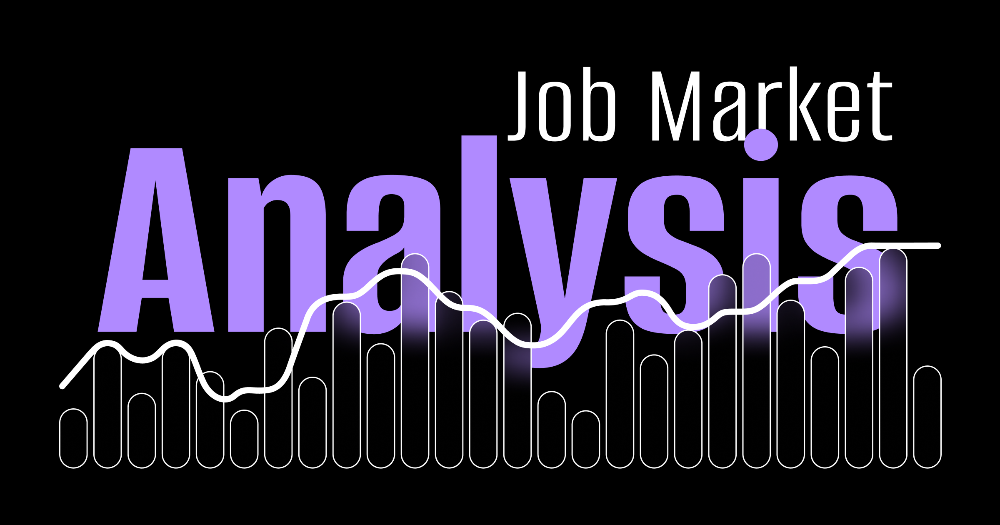
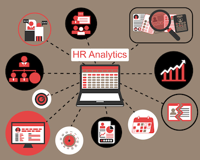
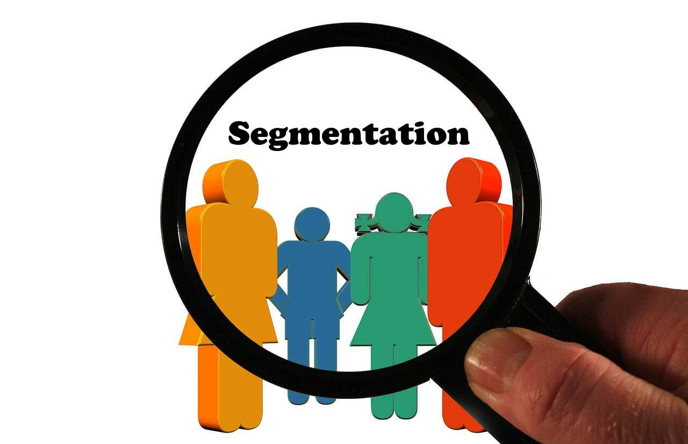

#  Data Portfolio  

👋 Welcome!

Welcome to my data portfolio! This repository showcases my data projects, demonstrating my skills in data collection, transformation, analysis, and visualization. Each project is designed to solve real-world problems using data-driven insights. You’ll find a variety of projects that highlight my expertise in SQL, Python, Power BI, machine learning applications, business intelligence dashboards, and full ETL workflows.

Each project includes a brief description, key skills demonstrated, and links to relevant files or dashboards. 

## Data Jobs Analysis  

A deep dive into the job market for data professionals! Using **Python and Power BI**, I analyzed job postings to uncover trends in demand, salaries, required skills, and industry preferences.  This project provides valuable insights into the evolving data landscape and guidance for aspiring data professionals.

🔗 [View Project](https://github.com/clemsonexcel/Data-Jobs-Analysis) 

## Hotel Analytics Report

**🏨 Hotel Booking & Customer Insights Dashboard**  
Understanding customer behavior and operational performance is key to optimizing hotel management. This project started with **SQL**, where multiple datasets were merged, cleaned, and transformed to uncover deeper insights. The **Power BI** report provides a detailed view of reservations, guest preferences, and business performance—helping hotels make data-driven decisions.

**Skills:** SQL, Data Cleaning, Data Transformation, Power BI, Visualization, Business Intelligence

🔗 [View Project](https://github.com/clemsonexcel/Hotel-Reservation-)  

## 🚴‍♂️ Bike Sales & Profit Dashboard | Power BI & SQL

Developed an interactive **Power BI** dashboard for a fictional bike company, analyzing key performance metrics like profit trends, revenue breakdowns, and rider demographics. The analysis explored the feasibility of a pricing strategy for the next year, providing insights into potential adjustments.  

🔗 [View Project](https://github.com/clemsonexcel/Dashboard-Projects/tree/main/Bike%20Share%20Analysis)  

## Employee Attrition Analysis

Employee turnover can be costly, but what if HR teams could predict and prevent it? This **Power BI** dashboard breaks down attrition data, providing key insights into employee exits. By summarizing trends and patterns, it helps businesses make data-driven decisions to improve retention.  

🔗 [View Project](https://github.com/clemsonexcel/Dashboard-Projects/tree/main/Employee%20Attrition%20Analysis)  
 

## Customer Segmentation with K-Means Clustering

Using mall customer data, I performed customer segmentation to identify key shopper groups for targeted marketing strategies. I applied the **K-Means clustering** algorithm for univariate, bivariate, and multivariate analysis, uncovering patterns in customer behavior. The analysis provided insights to help businesses tailor their marketing efforts effectively.

**Skills:** K-Means Clustering, Data Preprocessing, Exploratory Data Analysis (EDA), Visualization, Matplotlib, Seaborn

🔗 [View Project](https://github.com/clemsonexcel/Customer-Segmentation-Project)  

## Loan Prediction Model

Developed a **machine learning model** to predict loan approval based on historical data. The project involved data cleaning, feature engineering, and model evaluation to assess the loan eligibility of applicants.

🔗 [View Project](https://github.com/clemsonexcel/Loan-Prediction)  

## Movie Recommendation System

I Built an interactive **movie recommendation system** using **Python** in Jupyter Notebook. The system combines similarity-based recommendations and collaborative filtering to provide personalized movie suggestions. It suggests films similar to a given title and also considers what users with similar preferences have enjoyed, ensuring more tailored and relevant recommendations.

🔗 [View Project](https://github.com/clemsonexcel/Movie-Recommendation-System)  

### HR Absenteeism and Wellness Analysis

This project uses **SQL** and **Power BI** to analyze employee absenteeism and health data, driving incentive programs and wellness initiatives. The dashboard helps HR track trends, optimize workforce planning, and support data-driven decision-making.

🔗 [View Project](https://github.com/clemsonexcel/Dashboard-Projects/tree/main/Absenteeism%20%26%20Health%20Dashboard)  

## Superstore Sales & Profit Dashboard 

Explored retail performance using the classic **Superstore** dataset! This interactive dashboard visualizes key metrics like profit, sales by category, and revenue trends over the years. The analysis also examines state-wise contributions to sales, helping identify top-performing regions.

**Skills:** Excel, Data Visualization, Pivot Tables, Dashboards, Data Analysis, Business Intelligence

🔗 [View Project](https://github.com/clemsonexcel/Dashboard-Projects/tree/main/Superstore%20Dashboard)  

## Employee Presence Dashboard 

Understanding employee work patterns is crucial for HR decision-making. This Power BI dashboard analyzes a three-month employee attendance dataset, offering insights into work preferences, presence trends, and attendance patterns. By visualizing work-from-home rates, sick leaves, and office attendance, HR teams can make informed decisions for event planning and workforce management.  

🔗 **[View Project](https://github.com/clemsonexcel/Dashboard-Projects/tree/main/Employee%20Presence%20Dashboard)**  

## 🔍 Additional Projects  
These smaller projects focus on specific skills such as SQL analysis, data exploration, and visualizations:  
- **[Employee Data Analysis](link-to-repo)** (SQL, Business Analytics)
- **[Retail Sales Analysis](link-to-repo)** (SQL, Revenue Insights)  
- **[IMDb Movie Data Exploration](link-to-repo)** (Python, Pandas, Visualization) 
- **[Market Basket Analysis for E-Commerce](link-to-repo)** (Python, Visualization, eda) 

## 📌 More Projects Coming Soon!  
I am actively working on new projects, and this portfolio will keep evolving. Stay tuned for more exciting upates! 🚀

